## Raspberry Pi 家用 Server 架設

### 用 Raspberry Pi 當 Server 可以省錢

---

目前是把親朋好友的網站搬回家裡的 Raspberry Pi 中存放，可以省下一些錢。

遇到比較大的麻煩是，因為CPU是ARM架構，所以不是每一個Docker Image都可以用，要花時間找一下並測試。

---

2020 年8月16日收到

一次買 3 台，其中有一台是同事的

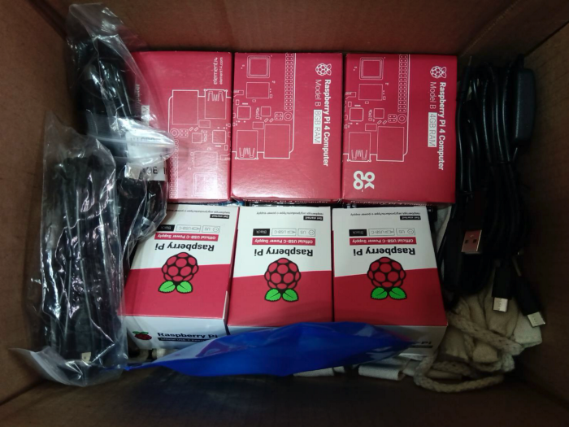{:width="800px"}

有送袋子

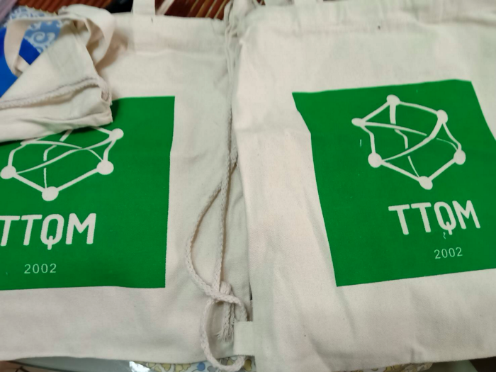{:width="800px"}

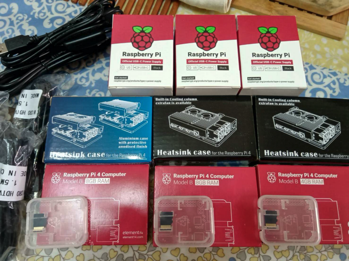{:width="800px"}

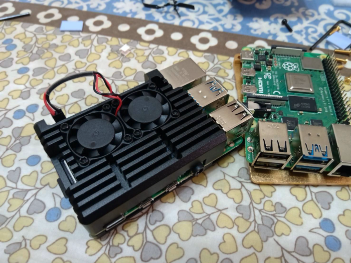{:width="800px"}

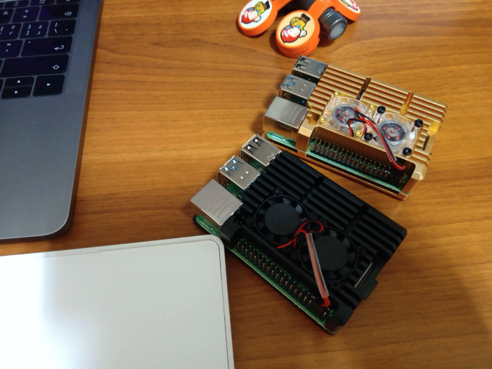{:width="800px"}

變壓器比想像中還大，所以只是這樣接，將來可能會換成 USB 電源 HUB，可以節省空間

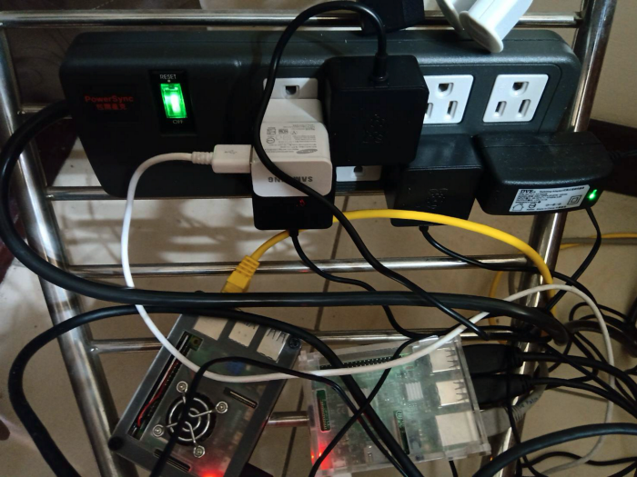{:width="800px"}

選擇無桌面版本，直接 CLI 介面操作

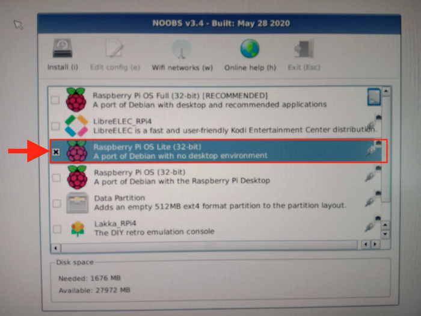{:width="800px"}

Raspberry Pi 4 的接線方式，螢幕要接在 HDMI-1 的位置

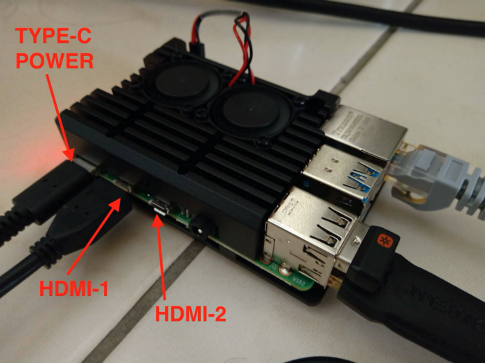{:width="800px"}

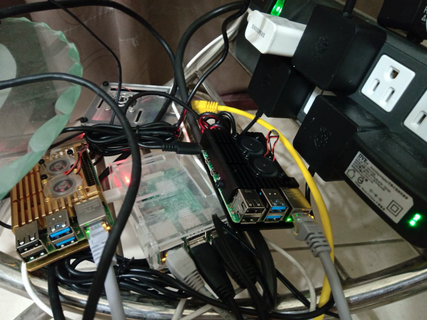{:width="800px"}

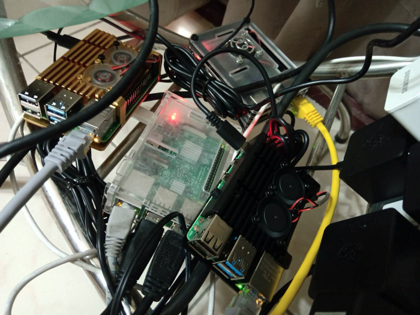{:width="800px"}

---

## 安裝 Docker

下載安裝腳本

``curl -fsSL https://get.docker.com -o get-docker.sh``

執行安裝腳本

``sudo sh get-docker.sh``

裝好要重啟系統才會正常

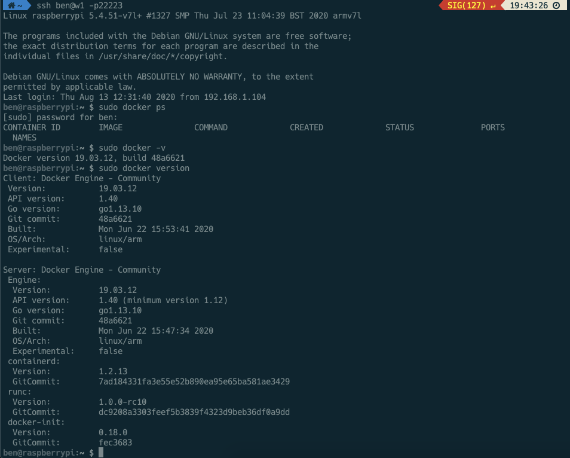{:width="800px"}

另外，也在樹莓派上掛載免費的Google Drive 15GB空間 (使用 rclone 工具)